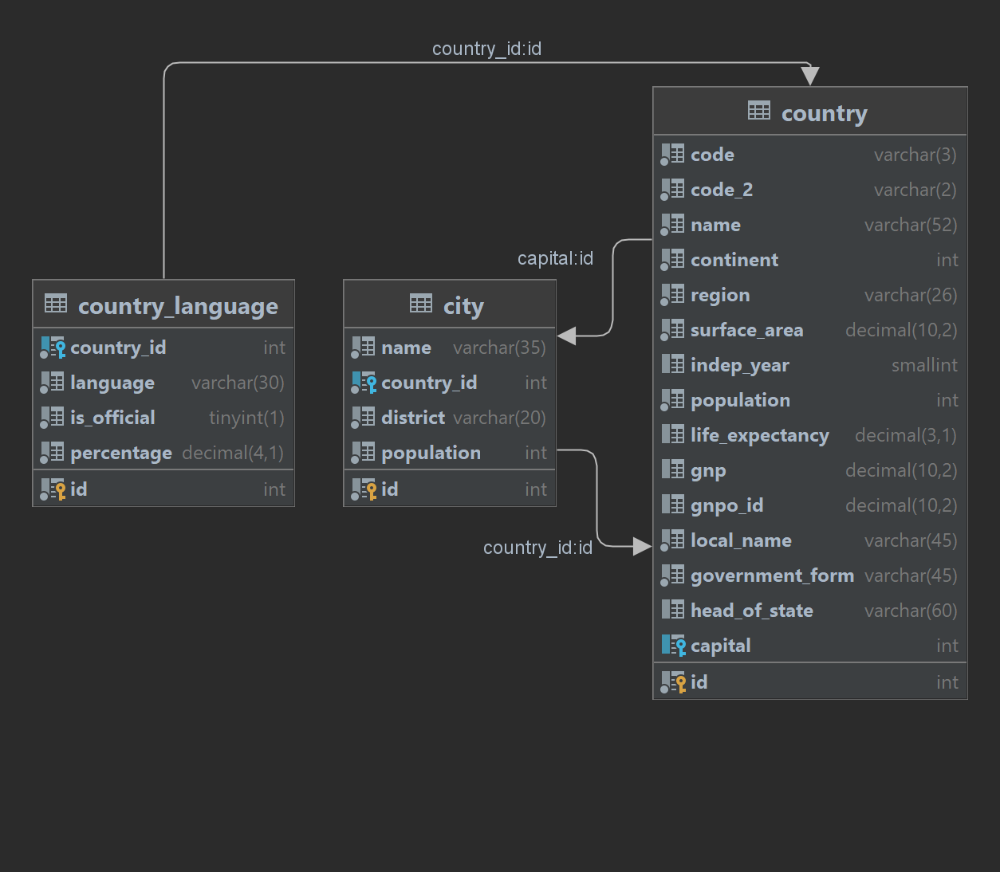

# Проект по теме: SQL, JDBC и Hibernate
JRU Uniform - М4 - финальный проект
## Технологии
MySQL, Hibernate, Redis, Docker.

<!--Установка-->
## Софт
1. IDEA Ultimate (у кого закончился ключ – пишите в слаке Роману)
2. Workbench (или любой другой клиент для MySQL)
3. Docker
4. redis-insight – опционально (http://localhost:8001/redis-stack/browser)

## Установка
1. Настроить докер.
2. Запустить MySQL сервер как докер-контейнер:
   - docker run --name mysql -d -p 3306:3306 -e MYSQL_ROOT_PASSWORD=root --restart unless-stopped -v mysql:/var/lib/mysql mysql:8
3. Открыть [дамп-файл](./dump-hibernate-final.sql) и развернуть его.
4. Создать проект в Идее, добавить зависимости maven   
5. Это maven проект со всеми необходимыми зависимостями (hibernate-core-jakarta, mysql-connector-java, p6spy, lettuce-core, jackson-databind).
6. Подключи в Идее БД. Схема world.
7. Запускать Main.java
8. Схема выглядит примерно так:
